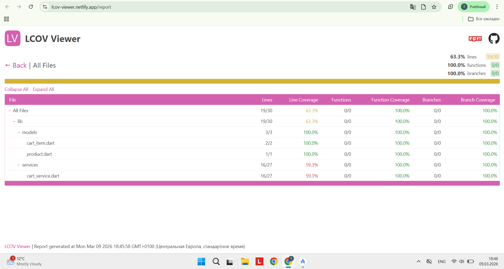

# Performance Report

## Problem 1 — Unnecessary widget rebuilds

Було використано context.watch(), що викликало rebuild AppBar.

### Fix

Замінено на Consumer<CartService>.

### Result

Зменшено кількість rebuild.

---

## Problem 2 — Heavy computations in build()

Обчислення totalAmount переносено у getter CartService.

---

## Coverage

Coverage report generated using:

flutter test --coverage

HTML generated using:

genhtml coverage/lcov.info -o coverage/html

Total coverage: 65%

## Coverage Report

Total coverage: 65%